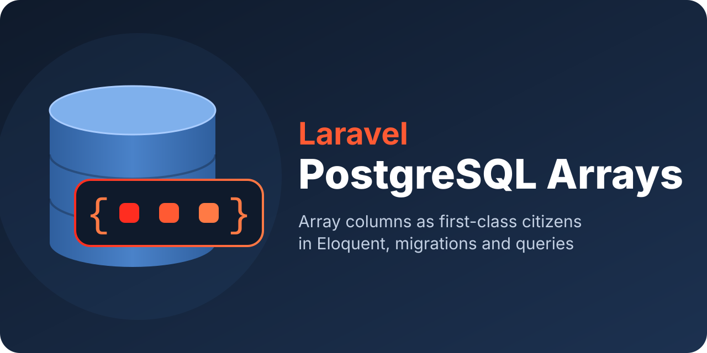

# Laravel PostgreSQL Arrays

[](https://packagist.org/packages/andreacolzani/laravel-pgarray)
[](LICENSE.md)
[](https://github.com/andreacolzani/laravel-pgarray/actions/workflows/run-tests.yml)
[](https://github.com/andreacolzani/laravel-pgarray/actions/workflows/fix-php-code-style-issues.yml)
[](https://github.com/andreacolzani/laravel-pgarray/actions/workflows/phpstan.yml)

[](#compatibility)
[](#compatibility)
[](#compatibility)



## Introduction

PostgreSQL can store a whole list of values in a single column: tags in a `text[]`, scores in an `integer[]`, references in a `uuid[]`. Laravel, however, has no built-in support for these columns, and turning `{php,"hello, world",NULL}` into a PHP array by hand is more error-prone than it looks.

This package lets you use array columns as naturally as any other column. You add a cast to your model and work with plain PHP arrays (or Collections) of strings, numbers, dates, enums or your own objects. It also adds a `pgArray()` column type for migrations and query builder methods for PostgreSQL's array operators.

## Installation

Install the package with Composer:

```bash
composer require andreacolzani/laravel-pgarray
```

Make sure your PHP, Laravel and PostgreSQL versions are [supported](#compatibility).

Optionally, you can publish the configuration file. You only need it to map [external serializers](#classes-you-cannot-modify):

```bash
php artisan vendor:publish --tag="laravel-pgarray-config"
```

## Quick start

Let's give blog posts a list of tags and a list of scores. First, create the columns in a migration:

```php
use AndreaColzani\PgArray\Enums\PgArrayType;

Schema::create('posts', function (Blueprint $table) {
    $table->id();
    $table->pgArray('tags', PgArrayType::Text)->default([]);     // text[] default '{}'
    $table->pgArray('scores', PgArrayType::Integer)->nullable(); // integer[] null
});
```

Then tell the model how to cast them:

```php
use AndreaColzani\PgArray\Casts\AsIntegerArray;
use AndreaColzani\PgArray\Casts\AsStringArray;

class Post extends Model
{
    protected function casts(): array
    {
        return [
            'tags' => AsStringArray::class,
            'scores' => AsIntegerArray::class,
        ];
    }
}
```

That's it: you can now read and write the columns as arrays, and query them.

```php
$post = Post::create([
    'tags' => ['php', 'laravel'],
    'scores' => [10, 20, null],
]);

$post->tags;   // ['php', 'laravel']
$post->scores; // [10, 20, null]

$laravelPosts = Post::wherePgArrayContains('tags', 'laravel')->get();
```

## Available casts

Pick the cast that matches the type of the elements. All casts live in the `AndreaColzani\PgArray\Casts` namespace.

| Cast | PHP elements | Column |
|---|---|---|
| `AsStringArray` | `string` | `text[]`, `varchar[]`, `char[]` |
| `AsIntegerArray` | `int` | `integer[]`, `smallint[]`, `bigint[]` |
| `AsDecimalArray` | `string` | `numeric[]`, `decimal[]` |
| `AsFloatArray`, `AsDoubleArray` | `float` | `double precision[]` |
| `AsRealArray` | `float` | `real[]` |
| `AsBooleanArray` | `bool` | `boolean[]` |
| `AsDateArray`, `AsImmutableDateArray` | Carbon | `date[]` |
| `AsDateTimeArray`, `AsImmutableDateTimeArray` | Carbon | `timestamp[]`, `timestamptz[]` |
| `AsUuidArray` | `Ramsey\Uuid\UuidInterface` | `uuid[]` |
| `AsUlidArray` | `Symfony\Component\Uid\Ulid` | `text[]` |
| `AsStringableArray` | `Illuminate\Support\Stringable` | `text[]` |
| `AsUriArray` | `Illuminate\Support\Uri` | `text[]` |

Decimals are returned as strings on purpose, so that no precision is lost along the way. There are also casts for `bytea`, `inet`, `macaddr`, pgvector and PostGIS columns, described in [Special PostgreSQL types](#special-postgresql-types).

If you prefer working with Collections, every cast has a `collect()` method:

```php
'scores' => AsIntegerArray::collect(),

$post->scores->sum(); // 30
```

Multidimensional arrays need no configuration at all: assign `[[1, 2], [3, 4]]` to an `integer[][]` column and you will get the same nested array back. `NULL` elements are preserved as `null`, and an empty array is stored as `{}`, so what you read is always what you wrote.

## Enums, value objects and JSON

When the built-in casts are not enough, `AsPgArray::of()` accepts any element type: a built-in cast, a backed enum or one of your own classes. You can pass `PgArrayContainer::Collection` as second argument to get a Collection.

```php
use AndreaColzani\PgArray\Casts\AsPgArray;
use AndreaColzani\PgArray\Enums\PgArrayCast;
use AndreaColzani\PgArray\Enums\PgArrayContainer;

'scores' => AsPgArray::of(PgArrayCast::Integer),  // same as AsIntegerArray::class
'statuses' => AsPgArray::of(Status::class),       // a backed enum
'emails' => AsPgArray::of(Email::class),          // a value object
'addresses' => AsPgArray::of(Address::class, PgArrayContainer::Collection), // JSON objects
```

### Backed enums

Backed enums work out of the box. You can assign either enum cases or their raw values, and you always get cases back. Use a `text[]` column for string-backed enums and an `integer[]` column for int-backed ones.

```php
enum Status: string
{
    case Draft = 'draft';
    case Published = 'published';
}

$post->statuses = [Status::Draft, 'published'];
$post->statuses; // [Status::Draft, Status::Published]
```

### Value objects

To store your own class, implement the `PgArrayValue` contract. It has two methods: one turns the object into a simple value to store, the other rebuilds the object from it. The package takes care of quoting and escaping.

```php
use AndreaColzani\PgArray\Contracts\PgArrayValue;

final class Email implements PgArrayValue
{
    public function __construct(public readonly string $address) {}

    public function toPgArrayValue(): string
    {
        return $this->address;
    }

    public static function fromPgArrayValue(mixed $value): static
    {
        return new static((string) $value);
    }
}
```

### JSON objects

Objects with several properties fit naturally in a `json[]` or `jsonb[]` column, where every element is a JSON document. Implement `PgArrayJsonValue` and add the `InteractsWithPgArrayJson` trait: it stores the object's properties and rebuilds the object through its constructor, so you don't have to write any serialization code.

```php
use AndreaColzani\PgArray\Concerns\InteractsWithPgArrayJson;
use AndreaColzani\PgArray\Contracts\PgArrayJsonValue;

final class Address implements PgArrayJsonValue
{
    use InteractsWithPgArrayJson;

    public function __construct(
        public readonly string $street,
        public readonly string $city,
        public readonly string $country,
    ) {}
}

$customer->addresses = [
    new Address('350 Fifth Avenue', 'New York', 'US'),
    new Address('1 Chome-1-2 Oshiage', 'Tokyo', 'JP'),
];

$customer->addresses[1]->city; // 'Tokyo'
```

### Classes you cannot modify

Sometimes the class you want to store belongs to another package, so you cannot make it implement a contract. In that case, write a serializer implementing `PgArrayValueSerializer` and map the class to it in the [configuration file](#installation):

```php
// config/pgarray.php
'serializers' => [
    Money::class => MoneySerializer::class,
],
```

The cast itself doesn't change: `AsPgArray::of(Money::class)`. For classes you own, the `#[PgArraySerializer(MoneySerializer::class)]` attribute is a handy alternative to the configuration.

## Encrypted and hashed arrays

Sensitive values can be encrypted or hashed **one element at a time**. Unlike Laravel's `encrypted:array` cast, which turns the whole array into a single encrypted string, the column stays a real PostgreSQL array. Ciphertexts and hashes are strings, so these casts need a `text[]` column.

```php
use AndreaColzani\PgArray\Casts\AsEncryptedArray;
use AndreaColzani\PgArray\Casts\AsHashedArray;

'secrets' => AsEncryptedArray::class,                 // encrypted strings
'pins' => AsPgArray::encrypted(PgArrayCast::Integer), // any element type can be encrypted
'recovery_codes' => AsHashedArray::class,             // hashed values
```

Encrypted values are decrypted transparently when you read them. Hashes, on the other hand, cannot be reversed, so you check a value against them with `PgArrayHash`. This is handy for one-time recovery codes:

```php
use AndreaColzani\PgArray\Support\PgArrayHash;

if (PgArrayHash::check($code, $user->recovery_codes)) {
    // the code is valid
}

// find() returns the key of the matching hash, so a used code can be removed
$key = PgArrayHash::find($code, $user->recovery_codes);
```

## Special PostgreSQL types

The package also supports a few PostgreSQL-specific types. `AsByteaArray` stores binary strings in `bytea[]` columns, while `AsInetArray` and `AsMacAddrArray` validate IP and MAC addresses and normalize them the way PostgreSQL does.

With the [pgvector](https://github.com/pgvector/pgvector) extension, `AsVectorArray` stores embeddings as `Vector` objects, optionally checking their dimensions. With [PostGIS](https://postgis.net), the `Point` value object handles `geometry[]` and `geography[]` columns, and `AsGeometryArray` / `AsGeographyArray` pass any other geometry through as a string. See [Compatibility](#compatibility) for how to enable these extensions.

```php
use AndreaColzani\PgArray\Casts\AsVectorArray;
use AndreaColzani\PgArray\Types\Point;
use AndreaColzani\PgArray\Types\Vector;

'embeddings' => AsVectorArray::withDimensions(1536),
'locations' => AsPgArray::of(Point::class),

$document->embeddings = [new Vector([0.12, -0.5, 0.33, /* … */])];
$store->locations = [new Point(latitude: 51.5072, longitude: -0.1276)]; // London
```

## Migrations

The `pgArray()` column type takes the name of the column and the type of its elements. It works with all of Laravel's usual modifiers, such as `nullable()`, `default()` and `change()`, and adds a few more to describe the element type:

```php
$table->pgArray('tags', PgArrayType::Text);                          // text[]
$table->pgArray('codes', PgArrayType::Varchar)->length(50);          // varchar(50)[]
$table->pgArray('prices', PgArrayType::Decimal)->precision(10, 2);   // decimal(10,2)[]
$table->pgArray('embeddings', PgArrayType::Vector)->size(1536);      // vector(1536)[]
$table->pgArray('places', PgArrayType::Geography)->subtype('Point'); // geography(Point,4326)[]
$table->pgArray('matrix', PgArrayType::Integer)->dimensions(2);      // integer[][]
```

Defaults can be written as plain PHP arrays, like `->default(['draft'])`. If an array must never contain `NULL` elements, `->withoutNullElements()` adds a check constraint for you.

## Query builder

PostgreSQL has dedicated operators to search inside arrays, and the package exposes them as query builder methods, available on Eloquent models and relations too:

```php
Post::query()
    ->wherePgArrayContains('tags', ['php', 'laravel']) // has all of these tags
    ->wherePgArrayOverlaps('tags', ['vue', 'react'])   // has at least one of them
    ->wherePgArrayContainedBy('tags', $allowedTags)    // has no other tags
    ->get();
```

Each method also has an `orWhere…` version and a negated one, such as `wherePgArrayDoesntContain()`. Values can be arrays, Collections or a single value.

To add elements without reading the row first, use `pgArrayAppend()` and `pgArrayPrepend()`, which update the column directly in the database:

```php
Post::whereKey($id)->pgArrayAppend('tags', 'featured');
Post::whereKey($id)->pgArrayPrepend('tags', 'breaking');
```

## Compatibility

The package supports:

- **PHP** 8.3, 8.4 and 8.5
- **Laravel** 12 and 13
- **PostgreSQL** 15, 16, 17 and 18

All of these versions are tested continuously, including against real PostgreSQL servers.

Everything works with a plain PostgreSQL installation, except for two column types that come from PostgreSQL extensions. [pgvector](https://github.com/pgvector/pgvector) provides the `vector` type used by `AsVectorArray`, and [PostGIS](https://postgis.net) provides the `geometry` and `geography` types used by `AsGeometryArray`, `AsGeographyArray` and `Point`. If you need them, install them on your database server by following the [pgvector](https://github.com/pgvector/pgvector#installation) or [PostGIS](https://postgis.net/documentation/getting_started/) installation guide, then enable them in a migration:

```php
DB::statement('CREATE EXTENSION IF NOT EXISTS vector');
DB::statement('CREATE EXTENSION IF NOT EXISTS postgis');
```

## Notes

- Date-times are stored with their UTC offset and read back in the application time zone. For consistent results, set the `timezone` of your `pgsql` connection to the application time zone.
- When querying `geometry[]` or `geography[]` columns with more than one value, pass the type as third argument, e.g. `PgArrayType::Geometry`: PostGIS separates array elements with `:` instead of `,`.
- Every exception thrown by the package implements `AndreaColzani\PgArray\Exceptions\PgArrayException`.

## AI assistants

If you use [Laravel Boost](https://github.com/laravel/boost), your AI coding assistant can learn how to use this package. It ships a short guideline and a detailed `pgarray-development` skill, with examples for migrations, casts, queries and common pitfalls. Boost picks them up automatically when you install it, or when you refresh its resources in a project that already uses it:

```bash
php artisan boost:install   # first installation
php artisan boost:update    # Boost already installed
```

## Testing

```bash
composer test
```

The integration tests need a PostgreSQL database: by default they connect to `pgarray_testing` on `127.0.0.1:5432`, and the connection can be changed with the `PGARRAY_DB_*` environment variables. If the database is not available, those tests are skipped.

## Changelog

Please see [CHANGELOG](CHANGELOG.md) for more information on what has changed recently.

## Security Vulnerabilities

Please report security vulnerabilities privately through [GitHub security advisories](../../security/advisories/new).

## Credits

- [Andrea Colzani](https://github.com/andreacolzani)
- [All Contributors](../../contributors)

## License

The MIT License (MIT). Please see [License File](LICENSE.md) for more information.
